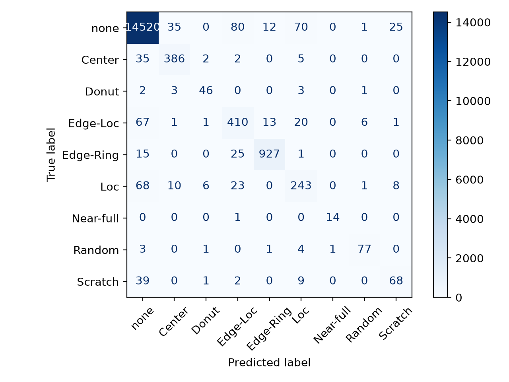

# Wafer Defect Classification using CNN

CNN-based wafer defect pattern classification and class imbalance analysis using the WM811K dataset.

## 1. Project Overview

반도체 Wafer Map의 불량 패턴을 CNN을 이용하여 분류하는 프로젝트입니다.

WM811K 데이터셋을 기반으로 Baseline CNN을 구축하고, 단순 Accuracy뿐만 아니라
Precision, Recall, F1-score 등 클래스별 성능을 분석합니다.

특히 데이터 불균형으로 인해 소수 불량 클래스의 검출 성능이 저하되는 문제를 확인하고,
이를 개선하면서 모델의 성능 변화를 비교하는 것을 목표로 합니다.

## 2. Dataset

본 프로젝트에서는 WM811K Wafer Map 데이터셋을 사용합니다.

- Original Dataset: 811,457 wafers
- Labeled Dataset: 172,950 wafers
- Number of Classes: 9

### Defect Classes

1. none
2. Center
3. Donut
4. Edge-Loc
5. Edge-Ring
6. Loc
7. Near-full
8. Random
9. Scratch

### Data Split

Label이 존재하는 172,950개의 wafer를 Train / Validation / Test 데이터로 분리하였습니다.

| Dataset | Samples | Ratio |
|---|---:|---:|
| Train | 138,360 | 80% |
| Validation | 17,295 | 10% |
| Test | 17,295 | 10% |
| **Total** | **172,950** | **100%** |

클래스 비율이 분할 과정에서 크게 변하지 않도록 Stratified Split을 적용하였습니다.

## 3. Data Preprocessing

WM811K의 wafer map은 샘플마다 크기가 서로 다르기 때문에,
CNN의 입력 크기를 `64 × 64`로 통일하였습니다.

단순히 모든 wafer를 64 × 64로 강제 Resize하면 원본 wafer의 가로세로 비율이
변형될 수 있으므로 다음과 같은 전처리 과정을 적용하였습니다.

1. 원본 Wafer Map의 Aspect Ratio 유지
2. Nearest Neighbor Interpolation을 이용한 Resize
3. 부족한 영역에 Zero Padding 적용
4. PyTorch Tensor (`float32`)로 변환
5. Channel dimension 추가

최종적으로 CNN에 입력되는 하나의 wafer shape은 다음과 같습니다.

```text
[1, 64, 64]

1     : Channel
64×64 : Wafer Map

## 4. Baseline CNN Architecture

Wafer Map의 공간적 불량 패턴을 학습하기 위해 3개의 Convolution Block으로 구성된
Baseline CNN을 구현하였습니다.

### Model Architecture

```text
Input
[1, 64, 64]
      ↓
Conv2d (1 → 16, 3×3, padding=1)
ReLU
MaxPool (2×2)
      ↓
[16, 32, 32]
      ↓
Conv2d (16 → 32, 3×3, padding=1)
ReLU
MaxPool (2×2)
      ↓
[32, 16, 16]
      ↓
Conv2d (32 → 64, 3×3, padding=1)
ReLU
MaxPool (2×2)
      ↓
[64, 8, 8]
      ↓
Flatten
      ↓
4096 Features
      ↓
Linear (4096 → 9)
      ↓
9-Class Logits
```

### Model Configuration

| Item | Configuration |
|---|---|
| Input Shape | `1 × 64 × 64` |
| Convolution Channels | `1 → 16 → 32 → 64` |
| Kernel Size | `3 × 3` |
| Activation | ReLU |
| Pooling | MaxPool `2 × 2` |
| Output Classes | 9 |
| Loss Function | CrossEntropyLoss |
| Optimizer | Adam |
| Learning Rate | 0.001 |
| Batch Size | 32 |

Convolution을 통해 특징을 추출하면서 채널 수를 `16 → 32 → 64`로 증가시키고,
Max Pooling을 통해 공간 크기를 `64 → 32 → 16 → 8`로 단계적으로 축소하였습니다.

마지막 Feature Map `[64, 8, 8]`을 Flatten하여 4,096개의 feature로 변환한 뒤,
Fully Connected Layer를 통해 9개 클래스에 대한 logit을 출력하도록 구성하였습니다.

## 5. Training Pipeline

PyTorch를 이용하여 Mini-batch 기반 학습 및 Validation Pipeline을 구현하였습니다.

### Training Process

```text
Mini Batch
    ↓
Move Data to GPU
    ↓
optimizer.zero_grad()
    ↓
Forward Pass
    ↓
CrossEntropyLoss
    ↓
loss.backward()
    ↓
optimizer.step()
    ↓
Weight Update
```

각 batch마다 이전 batch에서 계산된 gradient를 `optimizer.zero_grad()`로 초기화한 뒤,
Forward Pass를 통해 예측값을 계산합니다.

예측값과 실제 label을 `CrossEntropyLoss`로 비교하고,
`loss.backward()`를 통해 각 parameter의 gradient를 계산한 뒤
`optimizer.step()`을 통해 실제 weight를 업데이트합니다.

### Validation

각 Epoch의 Train이 완료된 후 Validation Dataset을 이용하여 성능을 평가합니다.

Validation 단계에서는 모델의 weight를 업데이트하지 않기 때문에
`model.eval()`과 `torch.no_grad()`를 사용하여 gradient 계산을 비활성화하였습니다.

```text
model.eval()
    ↓
Validation Data
    ↓
Forward Pass
    ↓
Loss Calculation
    ↓
Prediction (argmax)
    ↓
Accuracy / Precision / Recall / F1-score
```

학습과 평가는 NVIDIA GPU(CUDA)를 활용하도록 구성하였으며,
GPU에서 계산된 예측 결과를 CPU로 이동하여 클래스별 성능 지표를 분석하였습니다.

## 6. Baseline Results

Baseline CNN을 1 Epoch 학습한 후 Validation Dataset에서 성능을 평가하였습니다.

### Overall Performance

| Metric | Result |
|---|---:|
| Validation Loss | 0.1553 |
| Validation Accuracy | 95.82% |
| Macro Precision | 0.8529 |
| Macro Recall | 0.6775 |
| Macro F1-score | 0.6808 |
| Weighted F1-score | 0.9511 |

전체 Accuracy는 `95.82%`로 높게 나타났지만,
클래스별 성능을 분석한 결과 일부 소수 클래스에서 매우 낮은 Recall을 확인하였습니다.

### Class-wise Performance

| Class | Precision | Recall | F1-score | Support |
|---|---:|---:|---:|---:|
| none | 0.9691 | 0.9965 | 0.9826 | 14,743 |
| Center | 0.9052 | 0.8904 | 0.8978 | 429 |
| Donut | 0.9024 | 0.6607 | 0.7629 | 56 |
| Edge-Loc | 0.8408 | 0.5800 | 0.6864 | 519 |
| Edge-Ring | 0.9137 | 0.9845 | 0.9478 | 968 |
| Loc | 0.7845 | 0.3955 | 0.5259 | 359 |
| Near-full | 0.4167 | 1.0000 | 0.5882 | 15 |
| Random | 0.9434 | 0.5814 | 0.7194 | 86 |
| Scratch | 1.0000 | 0.0083 | 0.0165 | 120 |

### Class Imbalance Analysis

Validation Dataset의 17,295개 wafer 중 `none` 클래스는 14,743개로 대부분을 차지합니다.

Baseline 모델은 `none` 클래스에서 Recall `99.65%`를 기록한 반면,
일부 소수 defect class에서는 낮은 Recall을 보였습니다.

특히 `Scratch`의 경우:

```text
Support   : 120
Precision : 1.0000
Recall    : 0.0083
F1-score  : 0.0165
```

실제 Scratch wafer 120개 중 약 1개만 Scratch로 분류하여,
대부분의 Scratch pattern을 다른 클래스로 오분류하고 있음을 확인하였습니다.

따라서 전체 Accuracy `95.82%`만으로는 모델의 defect classification 성능을
충분히 평가할 수 없다고 판단하였습니다.

실제로 Weighted F1-score는 `0.9511`로 높지만,
각 클래스를 동일한 비중으로 평가하는 Macro F1-score는 `0.6808`로 크게 낮았습니다.

이를 통해 Baseline CNN이 다수 클래스에 편향되어 있으며,
소수 defect class의 검출 성능을 개선하기 위한 Class Imbalance 처리가 필요함을 확인하였습니다.

## 7. Class Imbalance Improvement Experiments

Baseline CNN은 Validation Accuracy 95.82%를 기록했지만, Macro F1-score는 0.6808에 불과했으며 특히 Scratch 클래스의 Recall은 0.83%로 매우 낮았습니다.

이에 따라 전체 Accuracy보다 클래스별 성능의 균형을 나타내는 **Macro F1-score를 주요 모델 선택 지표**로 설정하고, 클래스 불균형을 완화하기 위한 여러 방법을 비교하였습니다.

### 7.1 Class Weighting

먼저 클래스 빈도의 역수를 이용하여 CrossEntropyLoss에 Class Weight를 적용하였습니다.

단순 Inverse Class Weight는 Near-full과 같이 샘플 수가 매우 적은 클래스에 지나치게 큰 Weight를 부여하여 모델의 예측이 소수 클래스에 과도하게 편향되는 문제가 발생했습니다.

이를 완화하기 위해 Weight의 제곱근을 사용하는 Sqrt Class Weighting을 적용하였습니다.

```text
weight_c = sqrt(N / (C × N_c))

N   : 전체 Train Sample 수
C   : 클래스 수
N_c : 클래스 c의 Sample 수
```

이를 통해 다수 클래스와 소수 클래스 사이의 Weight 차이를 완화하면서도 Class Imbalance를 반영하도록 구성하였습니다.

### 7.2 Focal Loss

Class Imbalance에 대한 또 다른 접근으로 Focal Loss를 적용하였습니다.

```text
FL(p_t) = -(1 - p_t)^γ log(p_t)
```

본 실험에서는 `γ = 2.0`을 사용하여 쉽게 분류되는 샘플보다 모델이 분류하기 어려운 샘플의 Loss에 더 큰 영향을 주도록 구성하였습니다.

Focal Loss는 Scratch Recall을 Baseline 대비 크게 개선하였으나, 전체 클래스의 균형을 나타내는 Macro F1-score에서는 Sqrt Class Weighting보다 낮은 결과를 기록했습니다.

### 7.3 WeightedRandomSampler

Loss Function을 변경하는 방식과 별도로 `WeightedRandomSampler`를 적용하여 학습 과정에서 소수 클래스가 더 자주 선택되도록 구성하였습니다.

WeightedRandomSampler는 Macro Recall과 Scratch Recall을 크게 향상시켰지만, 소수 클래스에 대한 False Positive가 증가하면서 Precision이 감소하는 Trade-off가 발생했습니다.

### 7.4 Experiment Comparison

| Method | Accuracy | Macro Precision | Macro Recall | Macro F1 | Scratch Recall |
|---|---:|---:|---:|---:|---:|
| Baseline CE | 95.82% | 0.8529 | 0.6775 | 0.6808 | 0.83% |
| Focal Loss | 96.37% | 0.8229 | 0.8076 | 0.8061 | 35.00% |
| WeightedRandomSampler | 95.29% | 0.7801 | **0.8329** | 0.7979 | **65.83%** |
| Sqrt Weighted CE | **96.50%** | **0.8409** | 0.8320 | **0.8330** | 44.17% |

WeightedRandomSampler는 가장 높은 Macro Recall과 Scratch Recall을 기록하여 소수 클래스 검출에는 효과적이었지만, Precision 감소로 인해 Macro F1-score가 낮아졌습니다.

반면 Sqrt Weighted CrossEntropy는 Precision과 Recall 사이에서 가장 안정적인 균형을 보이며 **Macro F1-score 0.8330**으로 가장 높은 성능을 기록하였습니다.

따라서 이후 학습 최적화에는 **Sqrt Weighted CrossEntropy**를 적용한 모델을 사용하였습니다.


## 8. Training Optimization

Class Imbalance 대응 방법을 선정한 이후, 모델의 학습 수렴을 개선하기 위해 Learning Rate Scheduler와 Early Stopping을 적용하였습니다.

### Learning Rate Scheduler

Validation Macro F1-score가 일정 기간 개선되지 않을 경우 Learning Rate를 감소시키도록 `ReduceLROnPlateau`를 적용하였습니다.

```text
Initial Learning Rate : 0.001
Monitor               : Validation Macro F1
Factor                : 0.5
Scheduler Patience    : 2
```

이를 통해 학습 후반부에서 Learning Rate를 낮춰 보다 세밀하게 Parameter를 업데이트하도록 구성하였습니다.

### Early Stopping

최대 Epoch를 기존 10에서 30으로 증가시키고, Validation Macro F1-score가 6 Epoch 연속 개선되지 않을 경우 학습을 자동 종료하도록 구성하였습니다.

```text
Maximum Epochs          : 30
Early Stopping Patience : 6
Best Epoch              : 20
Stopped Epoch           : 26
```

최적 모델은 각 Epoch의 Validation Macro F1-score를 기준으로 저장하였습니다.

### Optimization Result

| Model | Accuracy | Macro F1 |
|---|---:|---:|
| Sqrt Weighted CE | 96.50% | 0.8330 |
| **+ LR Scheduler + Early Stopping** | **96.71%** | **0.8399** |

학습 최적화 적용 후 Validation Macro F1-score가 `0.8330 → 0.8399`로 향상되었으며, 최적 모델은 Epoch 20에서 저장되었습니다.


## 9. Final Test Evaluation

모델 선택과 Hyperparameter 조정에는 Train 및 Validation Dataset만 사용하였으며, 최종 모델을 확정한 이후 독립적으로 분리해 둔 Test Dataset을 사용하여 일반화 성능을 평가하였습니다.

### Final Test Performance

| Metric | Validation | Test |
|---|---:|---:|
| Accuracy | 96.71% | **96.51%** |
| Macro Precision | 0.8387 | **0.8429** |
| Macro Recall | 0.8447 | **0.8370** |
| Macro F1-score | 0.8399 | **0.8395** |

Validation Macro F1-score `0.8399`와 Test Macro F1-score `0.8395`의 차이는 0.0004로, Validation에서 선택한 모델의 성능이 독립 Test Dataset에서도 유사하게 유지되었습니다.

### Test Class-wise Performance

| Class | Precision | Recall | F1-score | Support |
|---|---:|---:|---:|---:|
| none | 0.9845 | 0.9849 | 0.9847 | 14,743 |
| Center | 0.8874 | 0.8977 | 0.8925 | 430 |
| Donut | 0.8070 | 0.8364 | 0.8214 | 55 |
| Edge-Loc | 0.7551 | 0.7900 | 0.7721 | 519 |
| Edge-Ring | 0.9727 | 0.9576 | 0.9651 | 968 |
| Loc | 0.6845 | 0.6769 | 0.6807 | 359 |
| Near-full | 0.9333 | 0.9333 | 0.9333 | 15 |
| Random | 0.8953 | 0.8851 | 0.8902 | 87 |
| Scratch | 0.6667 | 0.5714 | 0.6154 | 119 |

특히 Baseline에서 Recall이 `0.83%`에 불과했던 Scratch 클래스는 최종 Test에서 **57.14%**까지 향상되었습니다.

동시에 Scratch Precision `66.67%`, F1-score `0.6154`를 기록하여 단순히 소수 클래스를 과도하게 예측하는 방식이 아니라 Precision과 Recall 사이의 균형도 개선되었습니다.

### Test Confusion Matrix




## 10. Conclusion

본 프로젝트에서는 WM811K Wafer Map Dataset을 이용하여 CNN 기반 9-Class Defect Classification 모델을 구현하였습니다.

초기 Baseline 모델은 Validation Accuracy `95.82%`를 기록했지만, 클래스별 성능 분석을 통해 높은 Accuracy가 데이터 불균형에 의해 왜곡될 수 있음을 확인하였습니다. 특히 Scratch 클래스는 실제 120개 중 약 1개만 검출하여 Recall이 `0.83%`에 불과했습니다.

이에 따라 평가 기준을 Accuracy 중심에서 **Macro F1-score 중심으로 변경**하고, Class Weighting, Focal Loss, WeightedRandomSampler를 비교하였습니다. 그 결과 Precision과 Recall의 균형이 가장 우수한 Sqrt Weighted CrossEntropy를 선정하였습니다.

이후 ReduceLROnPlateau와 Early Stopping을 적용하여 학습을 최적화하였으며, 최종 모델은 독립 Test Dataset에서 다음 성능을 기록하였습니다.

```text
Test Accuracy : 96.51%
Test Macro F1 : 0.8395
Scratch Recall: 57.14%
Scratch F1    : 0.6154
```

이를 통해 전체 Accuracy를 유지하면서도 Baseline에서 취약했던 소수 Defect Class의 검출 성능을 개선하였습니다.

### Future Work

향후에는 다음과 같은 방향으로 프로젝트를 확장할 수 있습니다.

- Data Augmentation을 통한 소수 Defect Pattern 다양성 확보
- ResNet 등 다른 CNN Architecture와의 성능 비교
- Grad-CAM을 이용한 Defect Classification 판단 영역 시각화
- Error Analysis를 통한 Loc / Edge-Loc / Scratch 오분류 원인 분석
- Hyperparameter 및 Sampling Strategy 추가 최적화